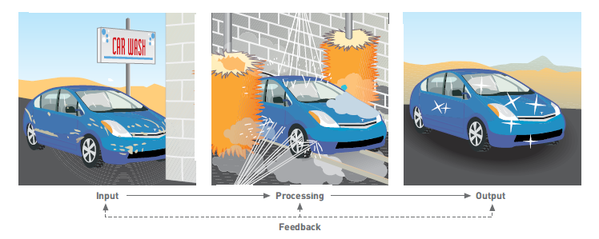
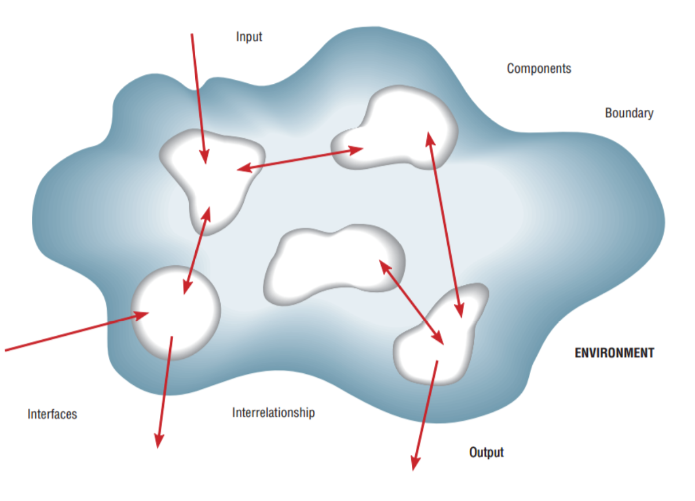
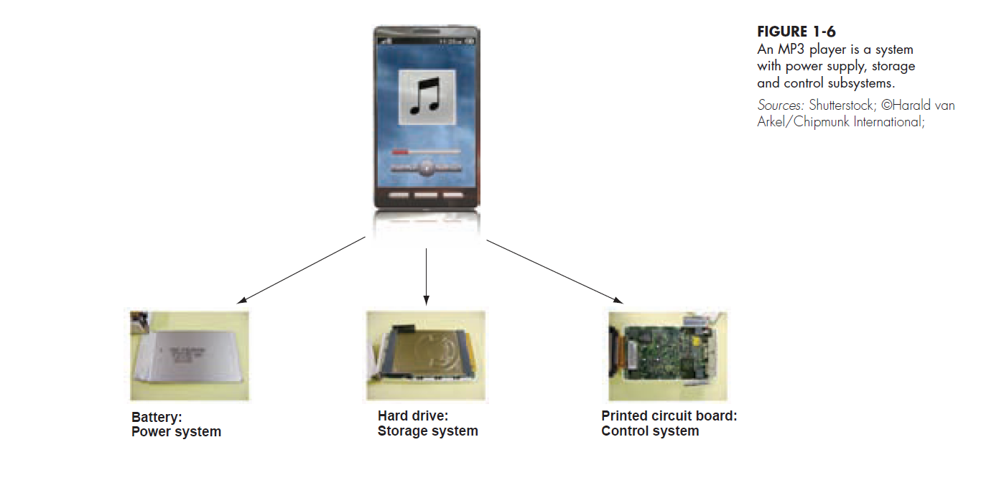
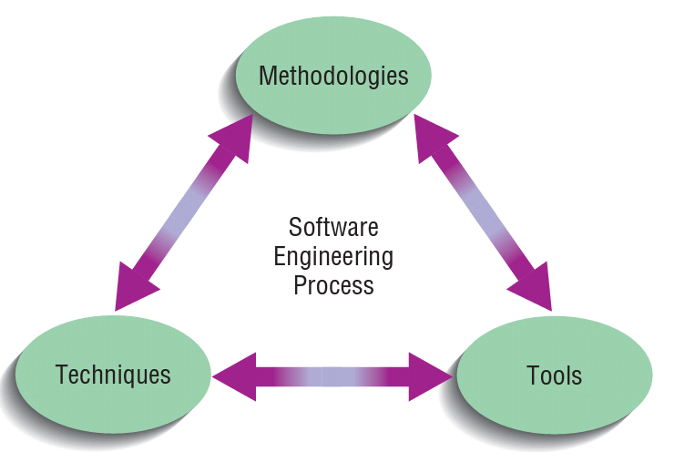
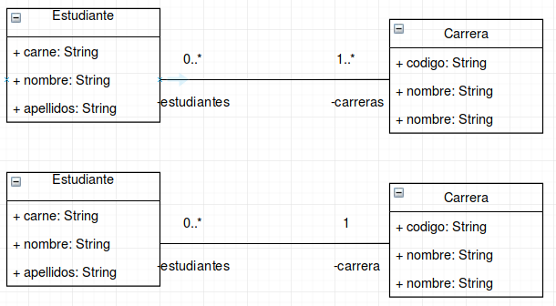
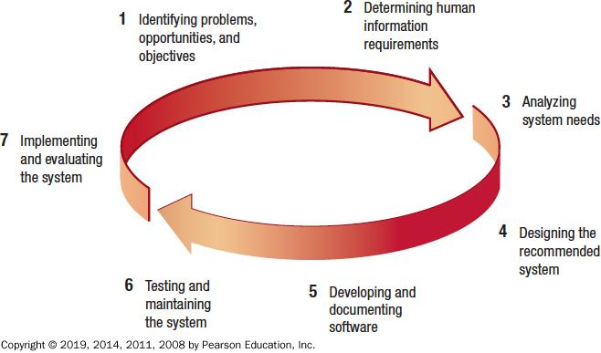
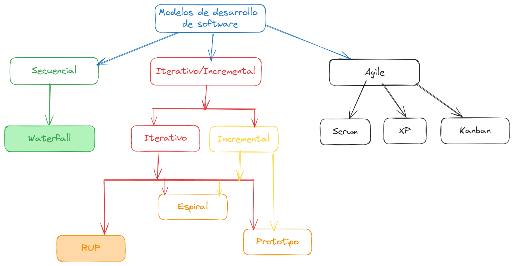
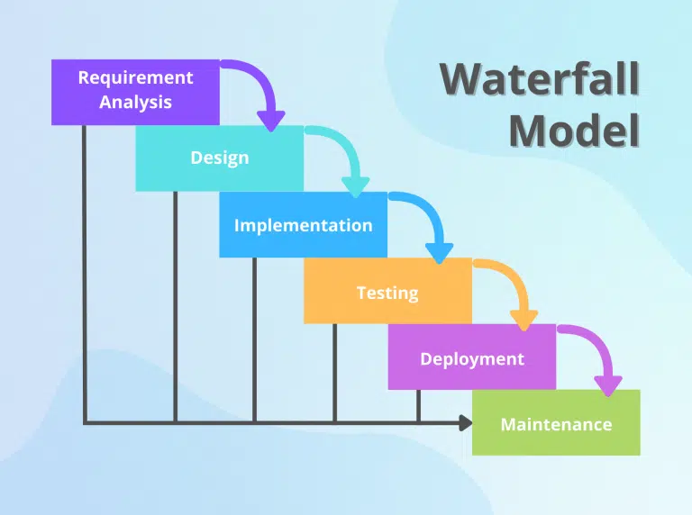
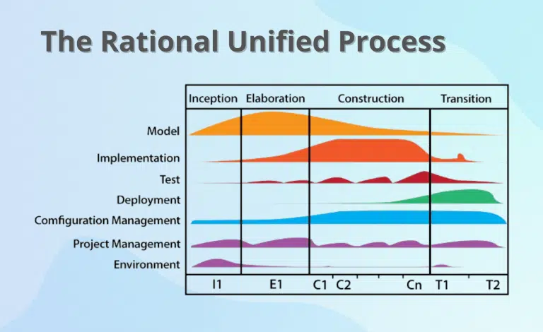

<!-- _class: cover -->

# Introducción al Análisis y Diseño
## Contenidos
- Sistemas y subsistemas
- Ingeniería de software
- Atributos de calidad
- Modelos de proceso de desarrollo

> Curso **Análisis y Diseño de Sistemas**  II Semestre 2026

---

## Análisis y Diseño de Sistemas

- Proceso organizacional **complejo** a través del cual los sistemas de información basados en computadoras son desarrollados y mantenidos

### El problema
- Existe una **brecha** entre la persona usuaria y quien analiza el sistema
- El usuario habla de su negocio, el analista habla de tecnología

### La respuesta
- **Transformar** en especificaciones, modelos y arquitecturas
- **Comunicación** efectiva
- **Involucrar** al usuario en todas las etapas

---

<!-- _class: cover -->

# Sistema y subsistemas
## Contenidos
- ¿Qué es un sistema?
- Sistema de información
- Descomposición y modularidad
- Acoplamiento y cohesión

---

## ¿Qué es un sistema?

- Conjunto de **elementos o componentes** que interactúan para lograr **objetivos**
- Los sistemas tienen entradas, mecanismos de procesamiento, salidas y **retroalimentación**

---

## Siete características de un sistema

<split-slide style="--left: 55%; --right: 45%;">

1. **Componentes** — las partes que lo forman
2. **Interrelaciones** — cómo dependen entre sí
3. **Frontera** (*boundary*) — qué está dentro y qué fuera
4. **Propósito** — para qué existe
5. **Entorno** — lo que lo rodea y le afecta
6. **Interfaces** — puntos de contacto con el entorno
7. **Restricciones** — límites que debe respetar

> Tomado de Valacich, J. (2012, p. 34)

</split-slide>

---

## Actividad 1

- Describe tu universidad como un **sistema**:

- ¿Cuál es la **entrada**?
- ¿Cuál es la **salida**?
- ¿Cuál es la **frontera**?
- ¿Cuáles son los **componentes**?

- ¿Cuáles son sus **interrelaciones**?
- ¿Cuáles son las **restricciones**?
- ¿Cuál es el **propósito**?
- ¿Cuáles son las **interfaces** y el **entorno**?

---

## Sistema de Información

- Según Kurbel (2008, p. 4) son sistemas **basados en computadoras** que:
  - Procesan información o datos de entrada
  - **Almacenan** y **recuperan** información
  - **Producen** nueva información
- ...para resolver tareas automáticamente o **soportar a los seres humanos** en la operación, control y toma de decisiones de una organización

---

## Actividad 2

- Con base en la definición de sistemas de información, identifica en el sistema de **Ematrícula**:

### ⬅️ Entradas
¿Qué datos recibe y de quién?

### ⚙️ Procesamiento
¿Qué reglas aplica?

### ➡️ Salidas
¿Qué produce y para quién?

---

## Sistema de Información: componentes

### 💾 Software
Los programas que ejecutan la lógica

### 🖥️ Hardware
Los equipos donde se ejecuta

### 🌐 Telecomunicaciones
La red que conecta todo

### 🗄️ Bases de datos
Dónde se almacena la información

### 📋 Procedimientos
Cómo se opera el sistema

### 👥 Personas
Quienes lo usan y lo mantienen

- Y no lo olvides → <spoiler>manuales y documentación</spoiler>

---

## Conceptos importantes: Descomposición

<steps>
<step>

- **Descomposición**: proceso de dividir el sistema en componentes pequeños
- Le permite a la persona analista:
  - Dividir un sistema en subsistemas **pequeños, manejables y comprensibles**
  - Concentrarse en **un área a la vez**, sin interferencia de otras áreas
  - Construir diferentes componentes en **momentos independientes** y con la ayuda de diferentes analistas

</step>
<step>

</step>
</steps>

---

## Conceptos importantes: Modularidad

### 🧩 Modularidad
Dividir un sistema en módulos de un tamaño **relativamente uniforme**

Los módulos **simplifican** el diseño del sistema

### 🔗 Acoplamiento
Los subsistemas que **dependen uno del otro** están acoplados

→ Buscamos acoplamiento **bajo**

### 🎯 Cohesión
Grado en el que un subsistema realiza **una sola función**

→ Buscamos cohesión **alta**

---

<!-- _class: cover -->

# Ingeniería de software
## Contenidos
- Niveles de abstracción
- Trazabilidad
- Proceso de ingeniería de software

---

## ¿Qué es la Ingeniería de Software?

- Según la visión de Manassis (2003, p. 1), la ingeniería de software es:

### 🔍 Refinamiento
Refinamiento del conocimiento a través de **sucesivos niveles de abstracción** y de representación

### 🧵 Trazabilidad
**Trazabilidad** de cada ítem de información entre los niveles de abstracción

- Es decir: pasamos del **problema del negocio** al **código**, sin perder el hilo entre uno y otro

---

## Niveles de abstracción

| Nivel | Espacio | Artefactos |
|:--|:--|:--|
| **Dominio Negocio** | Dominio | Industrias y funciones: Retail, CRM, Procurement, Fullfillment, I.C.E. |
| **Problema del Negocio** | Dominio | Visión y características del sistema |
| **Especificación** | Dominio | Requerimientos funcionales y no funcionales · Casos de uso |
| **Sistema** | Solución | Modelo de análisis · Casos de prueba · Modelo de seguridad |
| **Diseño e Integración** | Solución | Modelo de diseño · Scripts de prueba |
| **Desarrollo y Configuración** | Solución | Código · Configuración (.NET, Spring) |

---

## Trazabilidad

- La trazabilidad es una **técnica, herramienta y método** que conecta los niveles

<split-slide style="--left: 50%; --right: 50%;">

### Especificación → Construcción
- Problema del negocio
- Visión y características del sistema
- Especificación → **Casos de uso**
- Sistema → **Modelo de análisis**, modelo de seguridad
- Diseño e integración → **Modelo de diseño**
- Desarrollo y configuración → **Código**

### Verificación
- Casos de uso → **Casos de prueba**
- Modelo de diseño → **Scripts de pruebas**
- Código → **Resultados de pruebas**

 

- Si cambia un requerimiento, la trazabilidad nos dice **qué más hay que cambiar**

</split-slide>

---

## Proceso de Ingeniería de Software

<split-slide style="--left: 55%; --right: 45%;">

- **Metodologías** (*guías o enfoques*)
  - Cascada, RUP, Scrum, XP...
- **Técnicas** (*métodos*)
  - Casos de uso, UML, refactorización...
- **Herramientas** (*aplicaciones*)
  - IDEs, control de versiones, CI/CD...

 

- Los tres se **retroalimentan** entre sí

</split-slide>

---

<!-- _class: cover -->

# Atributos de calidad
## Contenidos
- Mantenibilidad y testeabilidad
- Modificabilidad
- Performance, seguridad y escalabilidad
- Disponibilidad

---

## Atributos de calidad del software

- Según Gomaa, H. (2011, p. 357) se refieren a **requerimientos no funcionales** del software, los cuáles tienen un profundo efecto en la **calidad** de un producto de software

<steps>
<step>

### 🔧 Mantenibilidad
- Medida en que el software puede ser **cambiado después de su despliegue**
- El software **debe evolucionar** → los negocios cambian
- El software debe ser diseñado para el **cambio y la adaptabilidad**

</step>
<step>

### 🔧 Mantenibilidad: ¿por qué cambia el software?
- Arreglar **errores** no detectados en las pruebas
- Abordar problemas de **rendimiento** visibles sólo cuando el software está en producción
- **Cambios** en los requerimientos del software

> De naturaleza en el **software**

</step>
</steps>

---

## Mantenibilidad: ¿qué diseño es mejor?

- ¿Por qué un diseño puede considerarse **más mantenible** que el otro?

---

## Testeabilidad y modificabilidad

<split-slide style="--left: 50%; --right: 50%;">

### 🧪 Testeabilidad
- Grado en que el software puede ser **objeto de pruebas**
- Se debe desarrollar un **plan de pruebas temprano** en el ciclo de vida
- ¿Cuáles pueden ser ejemplos de pruebas?

### ✏️ Modificabilidad
- Grado en que el software puede ser **modificado durante y después** del desarrollo inicial
- Un **diseño modular** integrado por módulos con interfaces bien definidas → **encapsulamiento**
- ¿Separación de la lógica en capas?

</split-slide>

> De naturaleza en el **software**

---

## Performance, seguridad y escalabilidad

### ⚡ Performance
Asociado con el **rendimiento** y los **tiempos de respuesta** esperados del software

### 🔒 Seguridad
El software enfrenta muchas **amenazas** que debe subsanar

Comprometen la **confidencialidad, disponibilidad e integridad** de la información

### 📈 Escalabilidad
Grado en que el sistema puede **crecer** luego de su despliegue inicial

- **Sistema (hw)** → más memoria o disco en un sistema centralizado, más nodos en uno distribuido
- **Software** → diseñado para crecer: componentes distribuidos o servicios (SOA)

---

## Disponibilidad

- Se relaciona con las **fallas del sistema** y su impacto en los usuarios y otros sistemas

### ❓ Pregunta 1
¿Qué sistemas necesitan estar **operacionalmente disponibles todo el tiempo**?

### ❓ Pregunta 2
¿Cómo lograr un sistema **tolerante a fallas**?

> De naturaleza en el **sistema** — hardware y software

---

<!-- _class: cover -->

# Modelos de proceso
## Contenidos
- Fases del ciclo de vida (SDLC)
- Modelos y enfoques
- Desarrollo en cascada
- RUP: iterativo-incremental

---

## Fases del ciclo de vida del desarrollo de sistemas

<split-slide style="--left: 50%; --right: 50%;">

1. Identificación de problemas, oportunidades y objetivos
2. Determinación de los **requerimientos** de información
3. **Análisis** de las necesidades del sistema
4. **Diseño** del sistema recomendado
5. **Desarrollo** y documentación del software
6. **Pruebas** y mantenimiento del sistema
7. **Implantación** y evaluación del sistema

> Kendall y Kendall (2019)

</split-slide>

---

## Fase 1: Identificación de problemas, oportunidades y objetivos

<split-slide style="--left: 50%; --right: 50%;">

### Actividad
- Se identifica una **necesidad** de un sistema nuevo o mejorado
- Las necesidades se identifican, analizan, **priorizan** y organizan
- Se determina el **alcance** del sistema propuesto
- Se documentan los resultados

### Salida
- **Reporte de factibilidad**, que contiene:
  - La **definición del problema**
  - Un resumen de objetivos que facilite a la gerencia la decisión de **proceder o no** con la propuesta de proyecto

</split-slide>

---

## Fase 2: Determinación de los requerimientos de información

<steps>
<step>

### Actividad: ¿cómo obtenemos la información?

- 🗣️ **Entrevista**
- 🎲 **Muestreo**
- 📄 **Revisión de documentos**

- 📝 **Cuestionarios**
- 👀 **Observar** el comportamiento del tomador de decisión y el ambiente
- 🧪 **Prototipado**

</step>
<step>

### Actividad: ¿qué debemos aprender?
- El **quién** → personas involucradas
- El **qué** → procesos de negocio
- El **dónde** → el ambiente en el cual el trabajo se efectúa
- El **cuándo** → los tiempos
- El **cómo** → cómo los procedimientos actuales se ejecutan
- El **porqué** → por qué se emplea el sistema actual (ya sea manual o computarizado)

</step>
<step>

### Salida
- La persona analista **comprende cómo la persona usuaria logra su trabajo** con los sistemas actuales: manuales o computarizados
- Empieza a concebir cómo hacer el nuevo sistema **más útil y usable**
- Debería conocer las **funciones del negocio**
- Tiene información completa sobre **gente, metas, datos y procedimientos** implicados

</step>
</steps>

---

## Fase 3: Análisis de las necesidades del sistema

<split-slide style="--left: 50%; --right: 50%;">

### Actividad
- La persona analista **estudia los requerimientos** y los **estructura** con base en sus interrelaciones

### Salida
- Descripción de la **solución alternativa recomendada** por el equipo de análisis
- Incluye recomendaciones sobre **lo que debería hacerse**

</split-slide>

---

## Fase 4: Diseño del sistema recomendado

<split-slide style="--left: 50%; --right: 50%;">

### Actividad
- Convierte la alternativa de solución en especificaciones **lógicas y físicas**
- Diseño de **procesos** del sistema, entradas y salidas (en pantalla o impresas)
- Diseño de la **interfaz humano-computador** (HCI)
- Diseño de **archivos** y/o base de datos
- Diseño de procedimientos de **respaldo**

### Salida
- **Especificación del diseño** del sistema

</split-slide>

---

## Diseño lógico vs. diseño físico

<split-slide style="--left: 50%; --right: 50%;">

### 📐 Diseño lógico
- Parte del proceso de diseño que es **independiente** de cualquier plataforma de software o hardware específico

> *A logical model shows **what** the system must do, regardless of how it will be implemented physically*

### 🏗️ Diseño físico
- Las especificaciones lógicas son transformadas en **detalles específicos** alineados con la tecnología, para permitir la construcción del sistema

> *A physical model is built that describes **how** the system will be constructed*

</split-slide>

- La escogencia del **lenguaje, base de datos y plataforma** usualmente la deciden la organización y el cliente

---

## Fases 5, 6 y 7

<steps>
<step>

### 5. Desarrollo y documentación del software
- La persona analista trabaja con **programadores** para desarrollar el software original
- Trabaja con **usuarios** para desarrollar documentación efectiva
- Se diseña, codifica y se eliminan los errores sintácticos de los programas
- Se documenta con **manuales de procedimiento**, ayuda en línea, FAQ y archivos *Read Me*
- **Salida** → programas de computadora y documentación del sistema

</step>
<step>

### 6. Pruebas y mantenimiento del sistema
- **Probar** el sistema de información
- **Mantenimiento** del sistema
- Documentación del mantenimiento
- **Salida** → problemas detectados (si los hay), programas actualizados y documentación

</step>
<step>

### 7. Implantación y evaluación del sistema
- **Capacitar** a las personas usuarias
- Planear la **conversión** del sistema viejo al sistema nuevo
- **Revisar y evaluar** el sistema
- **Salida** → personal capacitado y sistema instalado

</step>
</steps>

---

## Modelos y enfoques

---

## Desarrollo en cascada

<split-slide style="--left: 55%; --right: 45%;">

- Desarrollado por **Winston Royce** en 1970
- Proceso **secuencial** dividido en etapas con entradas y salidas
- La etapa siguiente inicia **cuando la previa es completada**

 

- ¿Qué pasa si un requerimiento cambia en la etapa de *Testing*?

</split-slide>

---

## Desarrollo iterativo-incremental: RUP

<split-slide style="--left: 55%; --right: 45%;">

- **Fases**: *Inception*, *Elaboration*, *Construction*, *Transition*
- **Disciplinas** (modelado, implementación, pruebas, despliegue...) que se ejecutan **en todas las fases**, pero con distinta intensidad
- Cada iteración produce un **incremento** ejecutable

 

- A diferencia de cascada, **no se espera** al final para probar o desplegar

</split-slide>

---

## Referencias

- Booch, G. et al. (2007). *Object-Oriented Analysis and Design with Applications*. 3ra. edición. USA: Pearson Education.
- Deek, F. P., McHugh, J. A. M., Eljabiri, O. M. (2005). *Strategic Software Engineering: An Interdisciplinary Approach*. USA: Auerbach Publications.
- Gomaa, H. (2011). *Software Modeling and Design: UML, Use Cases, Patterns, and Software Architectures*. NY: Cambridge University Press. {Cap. 20 — Atributos de calidad del software}
- Kendall, K. E., Kendall, J. E. (2019). *Systems Analysis and Design*. 10a. edición. Pearson.
- Kurbel, K. E. (2008). *The Making of Information Systems: Software Engineering and Management in a Globalized World*. Germany: Springer-Verlag Berlin Heidelberg.
- Manassis, E. (2003). *Practical Software Engineering: Analysis and Design for the .NET Platform*. Addison Wesley. {Cap. 1 — Introducción}
- Sommerville, I. (2005). *Ingeniería de Software*. 7ma. edición. Prentice-Hall.
- Valacich, J. (2012). *Essentials of Systems Analysis and Design*. USA: Pearson Education.
- Valacich, J. S. y George, J. F. (2017). *Modern Systems Analysis and Design*. Pearson, 8va. edición.
- Sharma, P. (2022). [Top software development models](https://cynoteck.com/es/blog-post/top-software-development-models-to-choose-from/)

