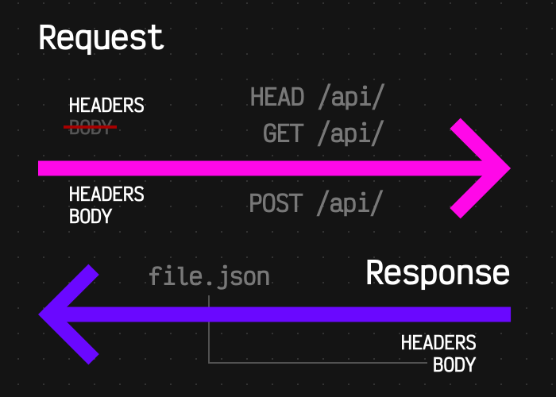

<!-- _class: cover -->
<style scoped>
section {
  --cover: url(../assets/img_00070_.avif);
}
</style>
# Fundamentos de desarrollo Web
## Contenidos
- Aplicaciones web
- Enfoque de pila completa (*Full Stack*)
- Tendencias: MPA, SPA, PWA y *native web apps*
- Frameworks

> Curso **Desarrollo de Software IV** <br>II Semestre 2026

---

<!-- _class: cover -->
<style scoped>
section {
  --cover: url(../assets/img_00017_.png);
}
</style>
# Aplicaciones web
## Contenidos
- Internet, la Web y los protocolos
- De la página estática a la aplicación web
- Arquitectura cliente-servidor y HTTP
- Aplicación web vs. aplicación móvil

---

## ¿Qué es Internet?

<div class="grid">
<div>

### 🌐 La red
- Conjunto **descentralizado** de redes de comunicación **interconectadas**
- Una red permite que dos computadoras **se comuniquen**
- Funciona como una **red lógica única** de alcance mundial, aunque esté formada por multitud de redes físicas heterogéneas
</div>
<div>

### 🔌 Los servicios
Sobre esa red se han desarrollado **servicios**: aplicaciones que se comunican para un fin determinado.

El servicio que más éxito ha tenido es la **World Wide Web**.
</div>
</div>

- ⚠️ **Web ≠ Internet** → la Web es *un* servicio de Internet, no Internet

---

## Web ≠ Internet

<split-slide style="--left: 50%; --right: 50%;">
<div>

### 🧬 Internet
- Inventado por **Vint Cerf** y Bob Kahn (protocolos TCP/IP, 1974)
- La **infraestructura**: cables, routers, direcciones IP
- Sobre ella viajan muchos servicios distintos
</div>
<div>

### 🕸️ La Web
- Inventada por **Tim Berners-Lee** (CERN, 1989)
- Un conjunto de **protocolos, estándares y tecnologías** basados en Internet
- Diseñada originalmente para la **consulta remota de información** en archivos de hipertexto
</div>
</split-slide>

- Primera web de la historia → [info.cern.ch](http://info.cern.ch/hypertext/WWW/TheProject.html)

---

## Otros servicios de Internet

- Un **protocolo** es un conjunto de reglas y procedimientos que deben respetarse para el **envío y la recepción** de datos a través de una red

<div class="grid">
<div>

### ✉️ Correo electrónico
`POP3`, `IMAP`, `SMTP`
</div>
<div>

### 📁 Transferencia de archivos
`FTP`, `SFTP`, `P2P`, `HTTP`
</div>
<div>

### 💬 Mensajería instantánea
`IRC`, `XMPP`, `MQTT`
</div>
<div>

### 🎬 Contenido multimedia
`VoIP`, `IPTV`, `RTP`, `WebRTC`
</div>
<div>

### ⌨️ Consola remota
`SSH`, `Telnet`
</div>
<div>

### 🖥️ Escritorio remoto
`VNC`, `RDP`
</div>
</div>

---

## Un poco de historia

<steps>
<step>

### 1962 — El origen militar
- A causa de la guerra fría, las Fuerzas Aéreas de EE.UU. piden una red de comunicaciones que **resista un ataque nuclear**
- En 1964 **Paul Baran** propone una red en forma de telaraña: un sistema **descentralizado**, capaz de seguir funcionando aunque se destruyan uno o varios equipos

</step>
<step>

### 1969-1983 — ARPANET → Internet
- ARPANET conecta las primeras universidades
- 1983: TCP/IP se convierte en el protocolo oficial → **nace Internet**

</step>
<step>

### 1989-1991 — Nace la Web
- Tim Berners-Lee propone en el CERN un sistema de **hipertexto** para compartir documentos
- Los tres pilares: **HTML** + **URL** + **HTTP**

</step>
</steps>

---

## Web 1.0 — Páginas estáticas

<split-slide style="--left: 55%; --right: 45%;">
<div>

- El usuario **solo leía** contenido publicado por otros
- Contenido **muy estático**, muy difícil de editar por el propio usuario
- El navegador web era la única aplicación *"conectada"*
- Los sitios eran conjuntos de **archivos HTML** en un disco
</div>
<div>

- Eran como **libros**, pero con navegación mediante **enlaces** en vez de secuencial
- Se editaban con herramientas parecidas a un procesador de textos (*Microsoft FrontPage*, *Dreamweaver*)

> A estas páginas se les llama **páginas web estáticas**
</div>
</split-slide>

- 🗄️ Museo de sitios web → [webdesignmuseum.org](https://www.webdesignmuseum.org/)

---

## Las cosas empiezan a cambiar

<steps>
<step>

- Poco a poco las tecnologías se desarrollan y los usuarios ganan **facilidades para editar el contenido**
- Google se populariza; nacen **Blogger**, **WordPress**, **Wikipedia**, **LinkedIn**...

</step>
<step>

### Páginas dinámicas
- En vez de ser **archivos HTML** en el disco, empiezan a ser **pequeños programas** que se ejecutan cada vez que un usuario pide una página
- Cambios mínimos al inicio (contador de visitas, fecha actual, cabecera variable) con lenguajes de script como **PERL** y **PHP**

</step>
<step>

### 2004 — Nace la Web 2.0
- **Dale Dougherty** (O'Reilly) acuña el término para referirse a la Web como una **plataforma** con aplicaciones ligeras, dinámicas y en constante evolución
- Las páginas dejan de ser documentos online para convertirse en **aplicaciones web**, y los usuarios **toman el control de los contenidos**

</step>
</steps>

---

## ¿Qué es una aplicación web?

- Una **aplicación web** es aquella que los usuarios utilizan accediendo a un **servidor web** a través de Internet mediante un **navegador**

<div class="grid">
<div>

### ✅ Independiente del SO
Corre en cualquier dispositivo con navegador
</div>
<div>

### ✅ Fácil de actualizar
Se despliega una vez, en el servidor
</div>
<div>

### ✅ Sin instalación
Basta una URL para empezar a usarla
</div>
</div>

- Ejemplos: Gmail, Google Docs, Figma, Spotify Web, Netflix, la Ematrícula de la UCR
- ¿Y qué diferencia hay entre un **sitio web** y una **aplicación web**? → <spoiler>la interacción: un sitio se consulta, una aplicación se usa (lee y escribe estado del usuario)</spoiler>

---

## ¿Cómo funciona la Web? — Arquitectura

<split-slide style="--left: 50%; --right: 50%;">
<div>

### 🏛️ ¿Qué es una arquitectura?
- Un **diseño a alto nivel** de cómo va a trabajar un sistema
- Determina **componentes**, **roles** y **comunicación**, a nivel lógico y físico
</div>
<div>

### 🔀 Arquitectura distribuida
- Los sistemas web proponen una arquitectura **distribuida**
- Los componentes se reparten en dos tipos de nodos:
  - **Clientes** (muchos)
  - **Servidores** (uno, al menos a nivel lógico)
</div>
</split-slide>

- 🌊 Internet es una red **intercontinental** gracias a los grandes cables submarinos de fibra óptica, con transmisiones de hasta **60 Tb/s**

---

## Cliente-Servidor



- La web responde a una arquitectura **cliente-servidor** que utiliza un protocolo de **pedido-respuesta**: HTTP
- El **cliente** hace un pedido *(request)*
- El **servidor** lo procesa y **responde** *(response)*
- El cliente es responsable de **presentar** la información al usuario

<br>

- Un solo servidor atiende a **miles** de clientes → escalabilidad y disponibilidad son problemas del servidor

---

## HTTP — HyperText Transfer Protocol

<split-slide style="--left: 50%; --right: 50%;">
<div>

- Protocolo que nos permite **pedir datos y recursos**
- Basado en el principio **cliente-servidor**
- Utiliza **cabeceras** *(headers)* para enviar metadatos
- Es **stateless**: no recuerda qué página pidió cada cliente
</div>
<div>

- En **HTTP/1.1** y anteriores los mensajes eran de **formato texto**
- En **HTTP/2** están estructurados en **formato binario** (y HTTP/3 va sobre QUIC/UDP)
- Existen **dos tipos** de mensajes:
  - **Peticiones** *(requests)*
  - **Respuestas** *(responses)*
</div>
</split-slide>

- 📖 [HTTP en MDN](https://developer.mozilla.org/es/docs/Web/HTTP/Overview) — el estado se recupera con **cookies**, *tokens* o sesiones

---

## Métodos HTTP

- HTTP define un conjunto de **métodos de petición** para indicar la acción que se desea realizar sobre un recurso. Cada uno implementa una **semántica** diferente

| Método | Acción | Idempotente | Con cuerpo |
|:--|:--|:--:|:--:|
| **GET** | Solicita un recurso | ✅ | ❌ |
| **POST** | Crea un recurso | ❌ | ✅ |
| **PUT** | Reemplaza un recurso | ✅ | ✅ |
| **PATCH** | Modifica parcialmente un recurso | ❌ | ✅ |
| **DELETE** | Elimina un recurso | ✅ | ❌ |

- Hay otros: `HEAD`, `OPTIONS`, `CONNECT`, `TRACE` → [Métodos HTTP en MDN](https://developer.mozilla.org/es/docs/Web/HTTP/Methods)

---

## Códigos de estado y URL

<split-slide style="--left: 45%; --right: 55%;">
<div>

### 🔢 Familias de códigos
- **1xx** — Informativo
- **2xx** — Éxito (`200 OK`, `201 Created`)
- **3xx** — Redirección (`301`, `304`)
- **4xx** — Error del **cliente** (`400`, `401`, `403`, `404`)
- **5xx** — Error del **servidor** (`500`, `502`, `503`)
</div>
<div>

### 🔗 Anatomía de una URL
```text
https://www.ucr.ac.cr:443/carreras?id=7#plan
└─┬─┘   └──────┬─────┘ └┬┘ └───┬──┘ └─┬─┘ └┬─┘
protocolo   dominio   puerto  ruta  query fragment
```

- Partes de una URL → <a href="../assets/url-parts.png" target="_blank">(I)</a> · <a href="../assets/url-parts-optionals.png" target="_blank">(II)</a> · <a href="../assets/query-strings.png" target="_blank">(III)</a>
</div>
</split-slide>

---

## Aplicación web vs. aplicación móvil nativa

| Criterio | 🌐 Aplicación web | 📱 Aplicación móvil nativa |
|:--|:--|:--|
| **Accesibilidad** | Acceso universal por navegador, sin instalación | Requiere instalación desde una tienda |
| **Conexión** | Depende de la conexión a Internet | Puede funcionar sin conexión |
| **Actualizaciones** | Inmediatas para todos los usuarios | Manuales o automáticas, vía tienda |
| **Recursos** | Consume recursos del navegador | Uso optimizado del hardware |
| **Hardware** | Acceso **limitado** a las capacidades del dispositivo | Acceso **completo** al hardware |
| **Portabilidad** | Un solo código para todo dispositivo con navegador | Una versión por plataforma (iOS, Android) |
| **Mantenimiento** | Centralizado | Separado por plataforma |

---

## Ventajas y desventajas

<split-slide style="--left: 50%; --right: 50%;">
<div>

### 🌐 Aplicaciones web
- ✅ Desarrollo más económico
- ✅ Mantenimiento simplificado
- ✅ Actualizaciones instantáneas
- ✅ Indexables por buscadores
- ❌ Menor rendimiento
- ❌ Funcionalidad limitada
- ❌ Suelen requerir conexión
</div>
<div>

### 📱 Aplicaciones móviles
- ✅ Mejor experiencia de usuario
- ✅ Mayor rendimiento
- ✅ Acceso completo al hardware
- ✅ Presencia en la tienda
- ❌ Desarrollo más costoso
- ❌ Mantenimiento complejo
- ❌ Proceso de aprobación en tiendas
</div>
</split-slide>

- 💡 La frontera se difumina: las **PWA** y las apps **híbridas** buscan lo mejor de ambos mundos

---

## Actividad 1

- Escoge una aplicación que uses todos los días (Ematrícula, Mediación Virtual, WhatsApp Web, Spotify...) y responde:

<div class="grid">
<div>

### 🔍 Clasifícala
¿Es un sitio web, una aplicación web o una app nativa? ¿Por qué?
</div>
<div>

### 🧩 Descompón
¿Qué hace el **cliente** y qué hace el **servidor**?
</div>
<div>

### ⚖️ Argumenta
¿Qué se ganaría y qué se perdería si fuera del otro tipo?
</div>
</div>

---

<!-- _class: cover -->
<style scoped>
section {
  --cover: url(../assets/img_00021_.png);
}
</style>
# Desarrollo de pila completa
## Contenidos
- ¿Qué es *Full Stack*?
- Back-end
- Front-end
- El perfil de la persona desarrolladora

---

## ¿Qué es el desarrollo *Full Stack*?

- El **stack** (pila) es el conjunto de tecnologías que se apilan para construir una aplicación completa
- Desarrollo **full stack** = ser capaz de trabajar en **todas las capas**, del navegador a la base de datos

<div class="grid">
<div>

### 🎨 Capa de presentación
Lo que el usuario ve y toca — **front-end**
</div>
<div>

### ⚙️ Capa de lógica
Reglas de negocio, autenticación, procesamiento — **back-end**
</div>
<div>

### 🗄️ Capa de datos
Persistencia y recuperación de información — **bases de datos**
</div>
</div>

- Stacks históricos: **LAMP** (Linux+Apache+MySQL+PHP), **MEAN/MERN** (Mongo+Express+Angular/React+Node), **JAMstack**

---

## Una página web es un sistema de software

- Son al menos **5 lenguajes** diferentes que **interactúan entre sí**

<split-slide style="--left: 50%; --right: 50%;">
<div>

### 🖥️ En el cliente
- **HTML** → estructura y contenido
- **CSS** → estilo (apariencia)
- **JavaScript** → comportamiento (interactividad)
</div>
<div>

### 🗃️ En el servidor
- **Lenguaje de servidor** → procesa código para crear páginas con contenido variable
- **SQL / lenguaje de consulta** → contiene y recupera los datos
</div>
</split-slide>

- Conviene mantenerlos **separados**, cada uno en su tarea → se puede **dividir el trabajo** en partes

---

<!-- _class: cover -->
<style scoped>
section {
  --cover: url(../assets/img_00033_.png);
}
</style>
# 1.2.1 Back-end
## Contenidos
- Servidores estáticos y dinámicos
- Componentes del back-end
- Bases de datos
- APIs

---

## Web 1.0 — Servidores estáticos

<split-slide style="--left: 55%; --right: 45%;">
<div>

1. El navegador hace una **petición** al servidor mediante HTTP
2. El servidor transforma la **URL** en una **ruta del sistema de archivos**
3. Devuelve el archivo al navegador

</div>
<div>

> Para una misma URL, el servidor siempre devuelve el **mismo recurso**: ficheros HTML, CSS, JavaScript, imágenes...

</div>
</split-slide>


---

## Web 2.0 — Servidores dinámicos

<steps>
<step>

- La mayoría de servidores web permiten que en cada petición se **ejecute un programa** que genera dinámicamente el recurso que se envía al usuario → *server-side scripting*
- Ahora, **para una misma URL el servidor puede devolver un recurso distinto**
- A este contenido generado *"al vuelo"* se le llama **contenido dinámico**, en contraposición al contenido estático obtenido del sistema de archivos

> 📧 Ejemplo: en Gmail, cada usuario ve **sus** correos

</step>
<step>

- Es normal que el contenido dinámico se genere con la información de una **base de datos**
- Los servidores con contenido dinámico no solo **envían** recursos: también **procesan** información que les llega del navegador
  - Datos completados por el usuario en formularios
  - Archivos enviados
  - Información codificada en los enlaces que pulsan los usuarios

</step>
</steps>

---

## ¿Qué hace el back-end?

<div class="grid">
<div>

### 🔐 Autenticación y autorización
Quién eres y qué puedes hacer
</div>
<div>

### 📐 Lógica de negocio
Las reglas del dominio: matricular, cobrar, reservar
</div>
<div>

### 💾 Persistencia
Guardar y consultar datos de forma consistente
</div>
<div>

### 🔗 Integraciones
Pasarelas de pago, correo, servicios externos
</div>
<div>

### 🛡️ Seguridad
Validación, cifrado, control de acceso, auditoría
</div>
<div>

### 📈 Escalabilidad
Caché, colas, balanceo de carga, observabilidad
</div>
</div>

- 🔑 Regla de oro: **nunca confíes en el cliente**. Toda validación crítica se repite en el servidor

---

## Tecnologías en el servidor

- Los **estándares no son tan necesarios** en el servidor: cada organización desarrolla con la tecnología de su elección

| Lenguaje | Frameworks habituales |
|:--|:--|
| **JavaScript / TypeScript** | Express, Fastify, NestJS, Hono (sobre Node, Deno o Bun) |
| **Python** | Django, FastAPI, Flask |
| **PHP** | Laravel, Symfony |
| **Java / Kotlin** | Spring Boot, Quarkus |
| **C#** | ASP.NET Core |
| **Go / Rust** | Gin, Echo · Axum, Actix |

- Estadísticas de uso real → [Netcraft](https://www.netcraft.com/blog/) · [W3Techs](https://w3techs.com/)

---

## Bases de datos

- Se encargan de **almacenar los datos de forma ordenada** y devolverlos rápidamente

<split-slide style="--left: 50%; --right: 50%;">
<div>

### 🧮 Relacionales (SQL)
- Datos en **tablas** con esquema fijo y relaciones
- Garantías **ACID**, consultas complejas con `JOIN`
- PostgreSQL, MySQL, SQL Server, Oracle, SQLite
</div>
<div>

### 📦 NoSQL
- Documentos, clave-valor, grafos o columnas
- Esquema **flexible**, diseñadas para **alta carga** y escalado horizontal
- MongoDB, Redis, Cassandra, Neo4j, DynamoDB
</div>
</split-slide>

- Las relacionales han sido las más populares, pero cada vez se usan más las NoSQL. **No compiten: se combinan**

---

## APIs — el contrato entre capas

- Una **API** *(Application Programming Interface)* define **cómo** el front-end le pide cosas al back-end

<split-slide style="--left: 55%; --right: 45%;">
<div>

```http
GET /api/cursos/SC-701 HTTP/1.1
Host: api.ucr.ac.cr
Accept: application/json
Authorization: Bearer eyJhbGciOi...
```
```json
HTTP/1.1 200 OK
Content-Type: application/json

{
  "sigla": "SC-701",
  "nombre": "Desarrollo de Software IV",
  "creditos": 4
}
```
</div>
<div>

- **REST** — recursos + métodos HTTP. El estándar de facto
- **GraphQL** — el cliente pide exactamente los campos que necesita
- **gRPC / tRPC** — llamadas tipadas entre servicios
- **WebSockets / SSE** — comunicación en tiempo real
</div>
</split-slide>

---

<!-- _class: cover -->
<style scoped>
section {
  --cover: url(../assets/img_00074_.png);
}
</style>
# 1.2.2 Front-end
## Contenidos
- El cliente web: los navegadores
- HTML, CSS y JavaScript
- Estándares web
- Modalidades de renderizado

---

## El cliente web: los navegadores

<split-slide style="--left: 50%; --right: 50%;">
<div>

### 🕰️ Historia
- **Mosaic** (1993)
- **Netscape** (1994)
- **Internet Explorer** (1995)
- **Opera** (1996)
- **Mozilla Firefox** (2002)
- **iPhone / Safari móvil** (2007)
- **Android** (2008) · **Chrome** (2008)
</div>
<div>

### ⚙️ Qué hay dentro
- **Motor de renderizado** — convierte HTML+CSS en píxeles (*Blink*, *Gecko*, *WebKit*)
- **Motor de JavaScript** — ejecuta el código (*V8*, *SpiderMonkey*, *JavaScriptCore*)
- **APIs web** — red, almacenamiento, cámara, geolocalización...
</div>
</split-slide>

- Cuota de mercado histórica → [StatCounter](https://gs.statcounter.com/browser-market-share)

---

## Páginas estáticas vs. páginas dinámicas (en el cliente)

<split-slide style="--left: 50%; --right: 50%;">
<div>

### 📄 Cliente estático
- El navegador renderiza el **HTML con CSS e imágenes, pero sin JavaScript**
- Cada clic en un enlace **recarga por completo** la página
- Se siguen usando mucho: páginas personales, *landing pages*, *home pages*, documentación
</div>
<div>

### ⚡ Cliente dinámico
- Las páginas incluyen **JavaScript** que se ejecuta en el navegador
- Se usa para:
  - Efectos gráficos e interactividad
  - **Peticiones en segundo plano** (AJAX / `fetch`)
  - **Single Page Applications**
</div>
</split-slide>

---

## Los tres lenguajes del front-end

<div class="grid">
<div>

### 📐 HTML
Proporciona la información **estructurada**: secciones, párrafos, títulos, imágenes.

La versión actual es **HTML5**: multimedia, comunicaciones, concurrencia y almacenamiento.
</div>
<div>

### 🎨 CSS
Define la **presentación** de un documento estructurado: distribución, colores, tipografías, fondos, efectos.

Sirve para HTML, XML, SVG e incluso interfaces de otras tecnologías.
</div>
<div>

### 🧠 JavaScript
Permite **modificar la página** y ejecutar código cuando se interactúa con ella.

Nació interpretado; hoy se ejecuta en **máquinas virtuales** optimizadas dentro del navegador.
</div>
</div>

- Hoy los navegadores son bastante **compatibles entre sí**... en el pasado no fue así 😅

---

## Estándares web

<split-slide style="--left: 55%; --right: 45%;">
<div>

- Existen estándares que indican **cómo es cada tecnología** usada en los navegadores (HTML, CSS, JavaScript)
- Intentan que la web sea **compatible con cualquier dispositivo**
- Quién los define:
  - **W3C** y **WHATWG** → HTML, CSS y APIs web
  - **ECMA TC39** → el lenguaje JavaScript (ECMAScript)
  - **IETF** → HTTP, TLS, URL
</div>
<div>

### 🔌 Tecnologías no estándar
- La web avanzó también gracias a tecnologías **no estándar** añadidas mediante **plugins**
- Algunas llegaron a ser estándares *"de facto"*, como **Adobe Flash**
- Los dispositivos móviles, las SmartTVs y la estandarización de **HTML5** las dejaron **en desuso**
</div>
</split-slide>

---

## ¿Dónde se renderiza la página?

<split-slide style="--left: 50%; --right: 50%;">
<div>

- **CSR** *(Client Side Rendering)* — el servidor manda un HTML casi vacío y JS construye todo en el navegador
- **SSR** *(Server Side Rendering)* — el HTML se genera en el servidor **en cada petición**
- **SSG** *(Static Site Generation)* — el HTML se genera **en el build** y se sirve como archivo
- **ISR / streaming** — mezclas de las anteriores
</div>
<div>

- Es una decisión con consecuencias reales en **SEO**, **tiempo de carga** y **coste de servidor**
- Comparativa visual → [Modalidades de renderizado](../assets/ssr-ssg-csr.png)

> Hoy casi ningún proyecto elige *una sola*: se decide **por ruta**
</div>
</split-slide>

---

## El perfil *Full Stack*

<split-slide style="--left: 50%; --right: 50%;">
<div>

### ✅ Ventajas
- **Visión completa** del sistema, de la UI a la base de datos
- Menos fricción de comunicación entre capas
- Muy valorado en **equipos pequeños** y startups
- Facilita prototipar y llevar una idea de punta a punta
</div>
<div>

### ⚠️ Riesgos
- *"Aprendiz de todo, maestro de nada"* si no hay profundidad
- El ecosistema es **enorme** y cambia rápido
- En equipos grandes se prefiere **especialización** con base full stack

</div>
</split-slide>

- 💡 Recomendación: **base amplia + una especialidad profunda** (perfil en «T»)

---

## Actividad 2

- En parejas, diseñen el *stack* de una aplicación de **reservas de laboratorios** para la Escuela:

<div class="grid">
<div>

### 🎨 Front-end
¿Qué necesita la interfaz? ¿CSR, SSR o SSG?
</div>
<div>

### ⚙️ Back-end
¿Qué lenguaje? ¿Qué endpoints expone la API?
</div>
<div>

### 🗄️ Datos
¿SQL o NoSQL? ¿Qué entidades guardan?
</div>
</div>

- Justifiquen **cada decisión** en una frase. No hay una única respuesta correcta

---

<!-- _class: cover -->
<style scoped>
section {
  --cover: url(../assets/img_00030_.png);
}
</style>
# Tendencias
## Contenidos
- Multi-Page Applications (MPA)
- Single-Page Applications (SPA)
- Progressive Web Applications (PWA)
- Native Web Applications

---

## El panorama

- Todas son formas de **entregar** una aplicación web. No son excluyentes entre sí

<div class="grid">
<div>

### 📚 MPA
Muchas páginas HTML, el servidor manda cada una
</div>
<div>

### 🔄 SPA
Una sola página, JavaScript reescribe el contenido
</div>
<div>

### 📲 PWA
Una web **instalable** que funciona offline
</div>
<div>

### 📦 Native web app
Web empaquetada como app **nativa** de escritorio o móvil
</div>
</div>

- Una misma aplicación puede ser **SPA + PWA**, o **MPA + PWA**, o una **SPA empaquetada** con Capacitor 🤯

---

## 1.3.1 Multi-Page Applications (MPA)

<split-slide style="--left: 50%; --right: 50%;">
<div>

### ⚙️ Cómo funciona
- Aplicación web **tradicional**: cada vista es un documento HTML distinto
- Cada navegación provoca una **petición al servidor** y una **recarga completa** de la página
- El servidor arma el HTML (SSR o SSG)
</div>
<div>

### ⚖️ Balance
- ✅ **SEO** excelente: cada página tiene su URL y su HTML
- ✅ Carga inicial rápida y simple
- ✅ Menos JavaScript en el cliente
- ❌ Navegación con parpadeo y recargas
- ❌ Estado compartido más difícil
</div>
</split-slide>

- Buenas para: **e-commerce**, portales de noticias, documentación, sitios con **mucho contenido**

---

## 1.3.2 Single-Page Applications (SPA)

<split-slide style="--left: 50%; --right: 50%;">
<div>

### ⚙️ Cómo funciona
- Se carga **una sola** página HTML
- Cuando hay que mostrar contenido nuevo, JavaScript usa `fetch` para pedir **datos** (no HTML) y **actualiza el DOM**
- El **enrutamiento** ocurre en el cliente (History API)
</div>
<div>

### ⚖️ Balance
- ✅ Navegación **fluida**, sin recargas
- ✅ Sensación de aplicación de escritorio
- ✅ El back-end se reduce a una **API**
- ❌ Carga inicial pesada (*bundle* de JS)
- ❌ SEO y accesibilidad más costosos
- ❌ Hay que reimplementar historial, foco, errores...
</div>
</split-slide>

- Buenas para: **dashboards**, editores, correo, herramientas internas → Gmail, Figma, Trello

---

## MPA vs. SPA

| | 📚 MPA | 🔄 SPA |
|:--|:--|:--|
| **Navegación** | Recarga completa del documento | Reescritura del DOM sin recargar |
| **Dónde se renderiza** | Servidor | Cliente (o híbrido) |
| **Carga inicial** | Ligera | Pesada (*bundle*) |
| **Navegación posterior** | Más lenta | Casi instantánea |
| **SEO** | Nativo | Requiere SSR o prerender |
| **Complejidad del front** | Baja | Alta |
| **Consumo de datos** | Repite HTML en cada vista | Solo datos (JSON) |

- 🧭 Los **meta-frameworks** modernos (Next, Nuxt, Astro) difuminan la frontera: SSR en la primera carga + navegación tipo SPA después

---

## 1.3.3 Progressive Web Applications (PWA)

- Una **PWA** es una aplicación construida con tecnologías web que ofrece una experiencia **similar a la de una app nativa**

<split-slide style="--left: 50%; --right: 50%;">
<div>

### 🌐 Como una web
- Un **único código base** para todas las plataformas
- Se accede por una **URL**
- **Indexable** por buscadores
- Sin tiendas de aplicaciones ni comisiones
</div>
<div>

### 📱 Como una app nativa
- Se **instala** en el dispositivo
- Funciona **offline** y en segundo plano
- Se **integra** con el sistema y otras apps
- Notificaciones, iconos, pantalla completa
</div>
</split-slide>

- 📖 [Progressive web apps en MDN](https://developer.mozilla.org/es/docs/Web/Progressive_web_apps)

---

## PWA — Los ingredientes

<steps>
<step>

### 1️⃣ Web App Manifest
Un JSON que le dice al sistema **cómo instalar** la aplicación

```json
{
  "name": "Reservas de Laboratorios UCR",
  "short_name": "Reservas",
  "start_url": "/",
  "display": "standalone",
  "background_color": "#0d1117",
  "theme_color": "#fe704d",
  "icons": [{ "src": "/icon-512.png", "sizes": "512x512", "type": "image/png" }]
}
```
</step>
<step>

### 2️⃣ Service Worker
Un script que corre **en segundo plano** e **intercepta** las peticiones de red

```js
// sw.js — estrategia "cache first"
self.addEventListener("install", (event) => {
  event.waitUntil(caches.open("v1").then((cache) => cache.addAll(["/", "/app.css", "/app.js"])));
});

self.addEventListener("fetch", (event) => {
  event.respondWith(caches.match(event.request).then((hit) => hit ?? fetch(event.request)));
});
```
</step>
<step>

### 3️⃣ HTTPS y registro

```js
// main.js
if ("serviceWorker" in navigator) {
  await navigator.serviceWorker.register("/sw.js");
}
```

- Los service workers **solo funcionan bajo HTTPS** (o `localhost`)
- Sin los tres ingredientes, el navegador **no ofrece instalar** la aplicación

</step>
</steps>

---

## PWA — Capacidades

<div class="grid">
<div>

### 📥 Instalable
Icono en el escritorio o el *home screen*, ventana sin barra del navegador
</div>
<div>

### ✈️ Offline
`Cache API` + `IndexedDB` para trabajar sin conexión
</div>
<div>

### 🔔 Notificaciones
`Notifications API` + `Push API`
</div>
<div>

### 🔁 Sincronización
`Background Sync` para reintentar cuando vuelva la red
</div>
<div>

### 📤 Integración
`Web Share`, asociación de tipos de archivo, *badges*, atajos
</div>
<div>

### 🚀 Actualización
Se actualiza sola desde el servidor, sin pasar por una tienda
</div>
</div>

- ⚠️ Limitaciones: soporte **desigual en iOS**, acceso al hardware más restringido que una app nativa

---

## 1.3.4 Native Web Applications

- Aplicaciones construidas con **tecnología web** pero **empaquetadas y distribuidas** como aplicaciones nativas

<steps>
<step>

### 📦 Web empaquetada (híbridas)
- El código web se ejecuta dentro de un **contenedor nativo** (*WebView*)
- **Plugins nativos** dan acceso a las APIs del dispositivo (cámara, GPS, biometría)
- Se publica en las tiendas como cualquier otra app
- Escritorio: **Electron**, **Tauri** · Móvil: **Capacitor**, Cordova (Ionic)

</step>
<step>

### ⚙️ Pseudo-nativas (multiplataforma)
- **Compilan a código nativo** y usan **componentes nativos** reales, no un WebView
- Mejor rendimiento que las híbridas, un solo código base
- **React Native**, **Flutter**, .NET MAUI
- Requieren conocer los **paradigmas y componentes** de cada plataforma

</step>
</steps>

---

## Native web apps — Electron vs. Tauri

| | ⚛️ Electron | 🦀 Tauri |
|:--|:--|:--|
| **Motor de render** | Empaqueta **Chromium** completo | Usa el **WebView del sistema** |
| **Tamaño de la app** | ~150 MB en un *"hola mundo"* | Habitualmente **< 10 MB** |
| **Memoria** | Alta | ~30-40 MB en reposo |
| **Backend nativo** | Node.js | Rust |
| **Consistencia visual** | Idéntica en todo SO | Depende del WebView de cada SO |
| **Ejemplos** | VS Code, Slack, Discord, Figma | Apps recientes centradas en tamaño y seguridad |

- 🧩 En móvil, **Capacitor** hace lo equivalente: envuelve tu web (que además puede seguir siendo una PWA) en un proyecto iOS/Android

---

## Ventajas y desventajas de las híbridas

<split-slide style="--left: 50%; --right: 50%;">
<div>

### ✅ Ventajas
- Desarrollo **multiplataforma** con un solo código base
- **Menor costo** de desarrollo
- **Reutilización** de conocimientos web
- Acceso a características nativas vía plugins
- Mantenimiento simplificado
</div>
<div>

### ❌ Desventajas
- **Rendimiento inferior** al nativo
- Experiencia de usuario menos pulida
- Limitaciones en funcionalidades avanzadas
- Mayor consumo de recursos
- Dependencia de plugins de terceros
</div>
</split-slide>

---

## Comparativa general

| | 📚 MPA | 🔄 SPA | 📲 PWA | 📦 Native web app |
|:--|:--:|:--:|:--:|:--:|
| **Instalable** | ❌ | ❌ | ✅ desde el navegador | ✅ desde la tienda |
| **Offline** | ❌ | Parcial | ✅ | ✅ |
| **SEO** | ✅✅ | ⚠️ | ✅ | ❌ |
| **Acceso al hardware** | Limitado | Limitado | Medio | ✅ Alto |
| **Costo de desarrollo** | Bajo | Medio | Medio | Medio-alto |
| **Distribución** | URL | URL | URL | Tienda (revisión) |
| **Actualizaciones** | Instantáneas | Instantáneas | Instantáneas | Vía tienda |

---

## ¿Cómo elegir?

<steps>
<step>

- ¿El contenido es **público** y el SEO es crítico? → **MPA** (o meta-framework con SSR/SSG)
- ¿Es una **herramienta** con mucha interacción y estado? → **SPA**
- ¿Necesitas **offline**, notificaciones o presencia en el escritorio, y la web te alcanza? → **PWA**

</step>
<step>

- ¿Necesitas **APIs nativas** que la web no expone, o **presencia en la tienda**? → **Capacitor / Electron / Tauri**
- ¿El **rendimiento** o la integración con la plataforma **son el producto**? → **nativo** o **React Native / Flutter**

> 💡 La decisión rara vez es técnica pura: pesan el **presupuesto**, el **tiempo al mercado** y el **equipo disponible**

</step>
</steps>

---

## Casos de estudio

<div class="grid">
<div>

### 📷 Instagram
Evolución de nativa a un enfoque más híbrido
</div>
<div>

### 🚗 Uber
Multiplataforma con alta complejidad técnica
</div>
<div>

### 💼 Microsoft Teams
Enfoque híbrido empresarial (Electron en escritorio)
</div>
<div>

### 🐦 Twitter Lite
Caso de éxito clásico de **PWA**: menos de 1 MB frente a decenas en la app nativa
</div>
<div>

### 🏋️ Sworkit
Éxito usando un framework híbrido
</div>
<div>

### 💻 VS Code
Un editor de escritorio... construido con tecnología web
</div>
</div>

---

<!-- _class: cover -->
<style scoped>
section {
  --cover: url(../assets/img_00067_.png);
}
</style>
# Frameworks
## Contenidos
- Librería vs. framework
- Front-end y meta-frameworks
- Back-end
- Cómo elegir

---

## ¿Qué es un framework?

<split-slide style="--left: 50%; --right: 50%;">
<div>

### 📚 Librería
- **Tú** llamas al código de la librería
- Resuelve **un problema concreto**
- Tú controlas el flujo del programa
- Ej.: `date-fns`, `zod`, `lodash`
</div>
<div>

### 🏗️ Framework
- El **framework** llama a tu código → *inversión de control*
- Define la **estructura** de la aplicación
- Impone convenciones: dónde van los archivos, cómo se enruta, cómo se construye
- Ej.: Angular, Django, Laravel
</div>
</split-slide>

- 🎯 *"Don't call us, we'll call you"* — el **principio de Hollywood**

---

## ¿Por qué usar un framework?

<div class="grid">
<div>

### ⏱️ Productividad
No reescribes enrutamiento, formularios ni renderizado
</div>
<div>

### 🧱 Estructura
Convenciones compartidas → equipos que se entienden
</div>
<div>

### 🛡️ Seguridad
Protecciones por defecto (XSS, CSRF, inyección)
</div>
<div>

### 🌍 Ecosistema
Documentación, plugins, comunidad, contrataciones
</div>
</div>

- ⚠️ El costo: **curva de aprendizaje**, dependencia del ecosistema y **actualizaciones** que hay que seguir
- ❓ ¿Siempre hace falta uno? → <spoiler>no: para un sitio pequeño, HTML+CSS+JS estándar es más rápido y dura más</spoiler>

---

## Frameworks de front-end

<div class="grid">
<div>

### ⚛️ React
El más usado (~40-45 % de cuota, >30 M descargas semanales). Librería de UI + un ecosistema enorme
</div>
<div>

### 💚 Vue
~15-20 %, curva de aprendizaje suave, muy fuerte en Asia-Pacífico
</div>
<div>

### 🅰️ Angular
~12-15 %, framework **completo** y opinado, fuerte en el mundo empresarial
</div>
<div>

### 🔥 Svelte
Compila a JavaScript sin *runtime*; la satisfacción más alta entre desarrolladores (~88 %)
</div>
<div>

### 🧩 Web Components
El estándar del navegador: `custom elements`, Shadow DOM. Sin framework
</div>
<div>

### 🪶 Alpine / HTMX
Interactividad ligera sobre HTML del servidor, sin *bundle*
</div>
</div>

- Comparativa → [Web Components vs. frameworks](../assets/webcomponents-vs-frameworks.png)

---

## Meta-frameworks

- La tendencia dominante: ya no se elige *React* o *Vue* a secas, sino **React + Next**, **Vue + Nuxt**, **Svelte + SvelteKit**

<split-slide style="--left: 50%; --right: 50%;">
<div>

- El **enrutamiento**, el **renderizado**, la **carga de datos**, el **caché** y el **despliegue** viven a este nivel
- **Next.js** — el dominante sobre React
- **Nuxt** — el equivalente en Vue
- **SvelteKit** — sobre Svelte
</div>
<div>

- **Astro** — orientado a contenido, envía **cero JavaScript por defecto**; permite islas de React/Vue/Svelte
- **Remix / TanStack Start** — enfoque en estándares web y tipado extremo a extremo
- **React Server Components** — renderizar en el servidor sin enviar JS al cliente
</div>
</split-slide>

- 🧪 En este curso trabajaremos con [Astro](https://astro.build/) → mazo *Astro*

---

## Frameworks de back-end

<div class="grid">
<div>

### 🟢 Node.js
**Express** (minimalista), **Fastify** (rendimiento), **NestJS** (arquitectura tipo Angular), **Hono** (edge)
</div>
<div>

### 🐍 Python
**Django** (baterías incluidas, ORM y admin), **FastAPI** (async y tipado), **Flask**
</div>
<div>

### 🐘 PHP
**Laravel** (el más popular hoy), **Symfony**
</div>
<div>

### ☕ Java / Kotlin
**Spring Boot**, **Quarkus** — el estándar corporativo
</div>
<div>

### 💜 C#
**ASP.NET Core** — muy integrado con el ecosistema Microsoft
</div>
<div>

### 🦫 Go / Rust
**Gin**, **Echo**, **Axum** — cuando el rendimiento manda
</div>
</div>

- 💡 Los meta-frameworks *full stack* (Next, Nuxt, Laravel) **borran la frontera** entre front y back

---

## Otros frameworks del ecosistema

<div class="grid">
<div>

### 🎨 CSS y UI
**Tailwind CSS** (utilidades), **Bootstrap** (componentes), **Material UI**, **shadcn/ui**
</div>
<div>

### 📱 Multiplataforma
**React Native**, **Flutter**, **Ionic** (con Capacitor), **.NET MAUI**
</div>
<div>

### 🖥️ Escritorio
**Electron**, **Tauri**, **Neutralino**
</div>
<div>

### 🔧 Herramientas de build
**Vite** (98 % de satisfacción), **esbuild**, **Rollup**, **Turbopack**
</div>
<div>

### 🧪 Testing
**Vitest**, **Jest**, **Playwright**, **Cypress**
</div>
<div>

### 🧠 Estado y datos
**TanStack Query**, **Zustand**, **Pinia**, **Redux**
</div>
</div>

- 🧩 En **Flutter** y **React Native** la unidad de construcción es el **widget** / componente prediseñado, con consistencia visual con el sistema operativo

---

## ¿Cómo elegir un framework?

<steps>
<step>

### 🔍 Criterios técnicos
- ¿Encaja con el **tipo de aplicación** (contenido, dashboard, tiempo real)?
- ¿Qué modalidad de **renderizado** necesito?
- **Rendimiento** y tamaño del *bundle*
- **Tipado** (TypeScript ya es ~40 % de adopción exclusiva)

</step>
<step>

### 👥 Criterios de equipo y negocio
- ¿Qué **sabe ya** el equipo? ¿Qué se contrata fácil en el mercado local?
- **Madurez**: ¿cuántos años lleva? ¿Quién lo mantiene? ¿Tiene *LTS*?
- **Documentación** y comunidad
- **Costo de salida**: ¿qué tan atrapados quedamos?

> 🚩 Mala razón para elegir: *"es lo nuevo"*. Buena razón: *"resuelve nuestro problema y podemos sostenerlo 5 años"*

</step>
</steps>

---

## Tendencias 2026

<div class="grid">
<div>

### 🤖 Desarrollo asistido por IA
Una parte creciente del código se genera con asistentes
</div>
<div>

### 🧭 Meta-frameworks por defecto
Next, Nuxt y SvelteKit como punto de partida
</div>
<div>

### 🔤 TypeScript
Adopción exclusiva creciente en proyectos nuevos
</div>
<div>

### ⚡ Vite en todas partes
El estándar de facto para el *tooling*
</div>
<div>

### 🌍 Edge computing
Ejecutar el render cerca del usuario
</div>
<div>

### 🪶 Menos JavaScript
Islas, RSC y *zero-JS by default* (Astro)
</div>
</div>

---

## Actividad final

- Retomen la aplicación de **reservas de laboratorios** de la Actividad 2 y decidan:

<div class="grid">
<div>

### 🧭 Tendencia
¿MPA, SPA, PWA o *native web app*? ¿Por qué?
</div>
<div>

### 🏗️ Frameworks
Uno de front y uno de back. Justifiquen con **criterios**, no con modas
</div>
<div>

### ⚠️ Riesgos
¿Qué se rompe si el equipo cambia o el framework se abandona?
</div>
</div>

- Preparen **3 minutos** de defensa oral de sus decisiones

---

## Referencias

- MDN. [HTTP: Overview](https://developer.mozilla.org/es/docs/Web/HTTP/Overview) · [Métodos HTTP](https://developer.mozilla.org/es/docs/Web/HTTP/Methods) · [Progressive web apps](https://developer.mozilla.org/es/docs/Web/Progressive_web_apps)
- MDN. [SPA (Single-page application)](https://developer.mozilla.org/en-US/docs/Glossary/SPA)
- Wikipedia. [Progressive web app](https://en.wikipedia.org/wiki/Progressive_web_app)
- GoMage. [PWA vs SPA vs MPA: Understanding the Differences](https://www.gomage.com/blog/pwa-vs-spa-vs-mpa/)
- Ionic. [Building Progressive Web Apps con Capacitor](https://capacitorjs.com/docs/web/progressive-web-apps)
- InfoWorld. [Electron vs. Tauri: which cross-platform framework is for you?](https://www.infoworld.com/article/3547072/electron-vs-tauri-which-cross-platform-framework-is-for-you.html)
- Nucamp. [JavaScript Framework Trends in 2026](https://www.nucamp.co/blog/javascript-framework-trends-in-2026-what-s-new-in-react-next.js-vue-angular-and-svelte)
- Netcraft. [Web Server Survey](https://www.netcraft.com/blog/) · W3Techs. [Web technology surveys](https://w3techs.com/)
- Museo de diseño web → [webdesignmuseum.org](https://www.webdesignmuseum.org/) · Estadísticas globales → [DataReportal](https://datareportal.com/)
- Presentaciones del curso: *La red mundial: Internet — Introducción a la Web* y *Desarrollo web y desarrollo móvil*

<script src="../assets/steps.js"></script>
<script src="../assets/image-modal.js"></script>
